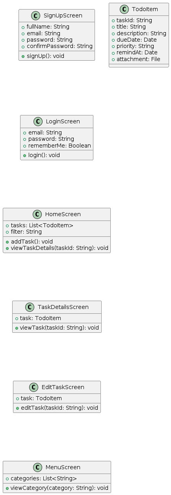
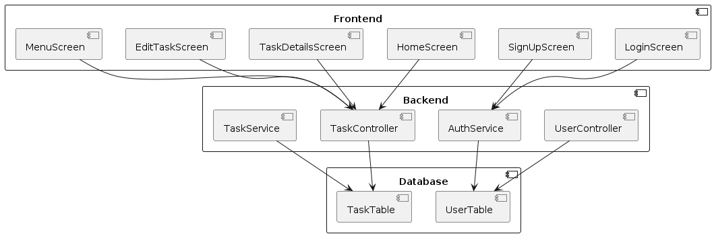
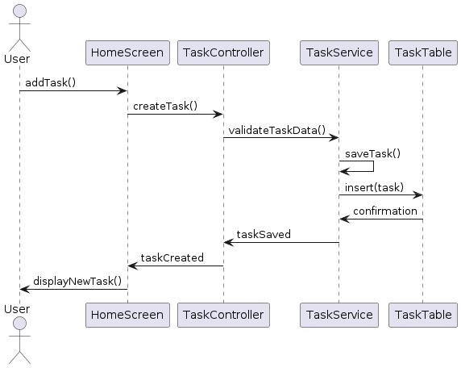
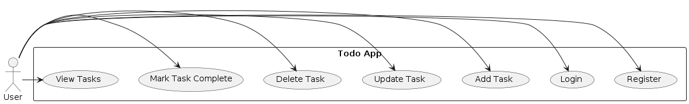
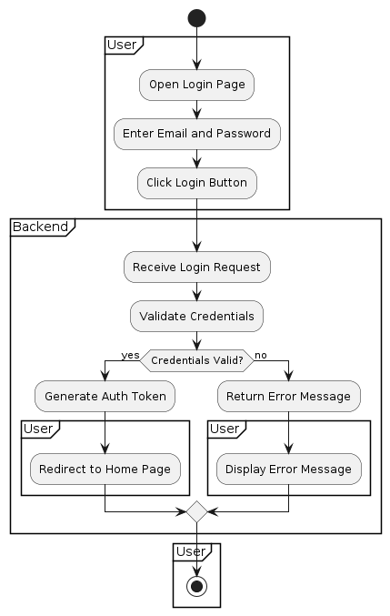
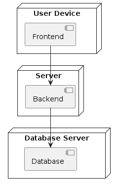
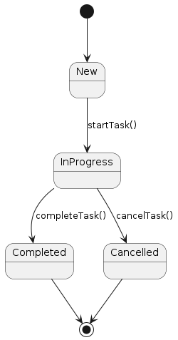

# Todo App Documentation

## UML Diagrams

### Class Diagram
This diagram represents the static structure of the system, showing classes, their attributes, methods, and relationships.

### Component Diagram
This diagram illustrates how components are wired together to form larger components or software systems.

### Sequence Diagram
This diagram shows how objects interact in a particular sequence of time, detailing the flow of messages between them.

#### Adding a Task

### Use Case Diagram
This diagram describes the functional requirements of the system, showing the interactions between actors (users) and use cases.

### Activity Diagram
This diagram represents the workflow or activities of a system, showing the sequence of activities and decision points.

#### User Login Process

### Deployment Diagram
This diagram shows the physical deployment of artifacts (software components) on hardware nodes.

### State Diagram
This diagram represents the states of an object and transitions between those states.

#### Task Lifecycle

